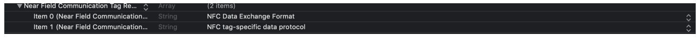



# Lettura del chip tramite NFC

## Prerequisiti
E’ importante ricordare che nonostante il framework supporti sistemi operativi pari o successivi alla versione *iOS 9*, questa funzionalità richiede almeno una versione **iOS 13** per poter essere eseguita.

Inoltre è necessario specificare nel file plist dell’applicativo le seguenti entries:

    <key>com.apple.developer.nfc.readersession.iso7816.select-identifiers</key>
    <array>
    	<string>A0000002471001</string>
    </array>

    <key>NFCReaderUsageDescription</key>
    <string>Consenti l&apos;accesso per poter rilevare tag NFC</string>

Dove la stringa che rappresenta il valore della chiave `NFCReaderUsageDescription` deve essere una frase che spieghi all’utente il motivo per cui l’applicazione sta richiedendo i permessi per l’utilizzo della tecnologia NFC.

Inoltre nel file entitlements dell’applicativo devono essere presenti le seguenti entry:

	

    <key>com.apple.developer.nfc.readersession.formats</key>
    	<array>
    		<string>NDEF</string>
    		<string>TAG</string>
    	</array>

 

Lato Apple Developer Center vanno configurati i seguenti aspetti:

Nella sezione *Identifiers*, in corrispondenza dell‘App ID corrispondente al bundle id dell’applicativo, nella sezione *Capabilities* va abilita la voce *NFC Tag Reading*

 
 
Infine occorre rigenerare il provisioning profile in modo da includere la nuova Capability.

## Utilizzo
Per la decodifica dei dati contenuti nel chip del documento elettronico il framework espone la classe swift `PINFCReader` la cui interfaccia contiene il metodo:

    public func readPassport(passportNumber: String, dateOfBirth: String, expiryDate: String, tags: [posteMRTDFramework.DataGroupId] = [], skipSecureElements: Bool = true, completed: @escaping (posteMRTDFramework.NFCPassportModel?, posteMRTDFramework.TagError?) -> ())

L’app deve invocare questo metodo passandogli come parametri mandatori i valori ottenuti dalla lettura della banda MRZ del documento elettronico:

 - il numero del documento,
 - la data di nascita
 - la data di scadenza del documento
 - La closure per la gestione dell’esito dell’operazione di lettura del chip

Il framework restituirà come parametri della closure una struttura dati di tipo `NFCPassportModel` contente tutti i valori letti nel chip, e un tipo di errore custom per la descrizione dell’errore in caso di mancata lettura del chip. Ovviamente i due parametri sono definiti come *optional* in modo tale da consentire facilmente all’app di discriminare l’esito dell’operazione di lettura. In caso di lettura andata a buon fine il parametro relativo all’errore sarà *nil*, mentre nel caso di lettura fallita sarà la classe di tipo `NFCPassportModel` ad essere *nil*.

Per quanto riguarda il tipo dei parametri restituiti, la classe `NFCPassportModel` esposta dal framework contiene tra gli altri i seguenti attributi:

 - *firstName* di tipo NSString, contenente il nome del titolare del documento,
 - *lastName* di tipo NSString, contenente il cognome del titolare del documento,
 - *passportMRZ* di tipo NSString, contenente la stringa MRZ del documento
 - *documentNumber* di tipo NSString, contenente il numero del documento
 - *documentType* di tipo NSString, contenente un carattere che indica il tipo di documento (“P” nel caso di passaporto e “C” nel caso di carta CIE)
 - *documentExpiryDate* di tipo NSString, contenente la data di scadenza del documento
 - *issuingAuthority* di tipo NSString, contenente una sigla che indica l’autorità che ha rilasciato il documento elettronico

Il parametro relativo all’errore appartiene invece ad un enumerato `TagError` esposto nel framework per indicare la tipologia di errore riscontrato durante la lettura del chip.

Quindi per effettuare la lettura dei dati contenuti nel chip del documento elettronico tramite NFC l’applicativo deve prima istanziare la class `PINFCReader`, quindi invocare su tale istanza il metodo appena descritto.

**Esempio** di lettura di un chip

     let nfcReader : PINFCReader = PINFCReader()
    
     nfcReader.readPassport(passportNumber: documentNumber, dateOfBirth: dateOfBirth, expiryDate: expiryDate) { (passport, error) in 
    
    	if let passport = passport { 
    		//gestione dei parametri letti
    	} else {
    		//gestione dell’errore
    	}
    }

A seguito dell’invocazione di questo metodo del framework, all’interno di quest’ultimo vengono salvati negli *UserDefaults*, tramite la classe di utility `PIMRTDDataHelper`, una serie di dati ottenuti dalla lettura del chip del documento elettronico, tra cui:

 - Il campo *DG1* espresso come stringa codificata in base 64
 - Il campo *DG2* espresso come stringa codificata in base 64
 - Il campo *DG11* espresso come stringa codificata in base 64
 - Il campo *DG12* espresso come stringa codificata in base 64
 - Il campo *SOD* espresso come stringa codificata in base 64

Il salvataggio in persistenza negli *UserDefaults* è funzionale all’invio di tali dati in upload verso il back-end.

Ancora una volta, il salvataggio di queste strutture dati viene effettuato dal framework contestualmente alla lettura del chip, ma la cancellazione delle stesse è demandata all’applicativo, al fine di garantire in ogni momento la consistenza dei dati acquisiti.

