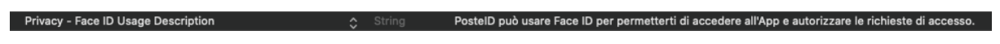


# Registrazione di un video 
Questa funzionalità permette all’utente di registrare un video in modalità live, cioè vedendo in tempo reale sul dispositivo la preview di quanto sta registrando. La durata della registrazione è configurabile, con un valore di default di 7 secondi.

## Prerequisiti

Per un corretto funzionamento di questa funzionalità del framework occorre inserire nel file plist dell’applicativo la seguente entry:

	<key>NSMicrophoneUsageDescription</key>
	<string>Consenti l&apos;accesso al microfono</string>

dove la stringa da inserire come valore deve essere una frase che spieghi chiaramente all’utente il motivo per cui l’applicativo ha bisogno dell’autorizzazione all’utilizzo del microfono.

## Utilizzo
Nell’utilizzo di questa funzionalità del framework sono coinvolti i seguenti componenti:

 - *PIVideoCamera* : il viewController che gestisce la registrazione del video.
 - *PIVideoRecording*: lo storyboard che contiene il `PIVideoCamera`; il bundleID è *it.poste.mrtdframework.posteMRTDFramework*

Per utilizzare la funzionalità di registrazione del video tramite il framework occorre caricare il viewController che esegue tale acquisizione. Per caricare il controller: 

 1. Linkare lo storyboard PIVideoRecording su un’action (esempio: pulsante), oppure istanziare lo storyboard PIVideoRecording con il metodo `[UIStoryboard storyboardWithName:… bundle:…]` utilizzando il
    bundle *it.poste.mrtdframework.posteMRTDFramework*
 2. Recuperare dallo storyboard il riferimento al `PIVideoCamera` mediante il metodo `prepareForSegue`…, o mediante il metodo `instantiateInitialViewController` dell’oggetto storyboard (se lo storyboard è stato linkato manualmente nel codice)

La registrazione viene avviata quando l’utente preme il pulsante circolare in basso alla view. Da quel momento viene visualizzato in corrispondenza dello stesso tasto un *countdown* che mostra il tempo residuo di registrazione.  Se durante la registrazione l’app passa nello stato *inactive* o *background* la registrazione viene interrotta e il framework invia un errore all’applicativo.

## Impostazioni grafiche, durata del video e risoluzione

Grazie ad alcune properties esposte dal framework l’applicativo può  configurare vari aspetti di questo viewController:
	

 - *topTextAttributed*, di tipo NSAttributedString permette di impostare una stringa formattata che precede il titolo
 - *videoText*, di tipo NSString: permette di impostare un titolo non formattato
 - *videoTextAttributed*, di tipo NSAttributedString: permette di
   impostare un titolo formattato
 - *bottomVideoTextImage*, di tipo UIImage: permette di impostare un’immagine da mostrare come sfondo della stringa `videoText` o `videoTextAttributed`

**N.B.** Il valore impostato sull’attributo `videoText` ha la precedenza su `videoTextAttributed`.

Ad esempio si può utilizzare il `topTextAttributed` per impostare una frase fisso come “Pronuncia” e l’attributo `videoText` per impostare una frase costruita dinamicamente che l’utente deve pronunciare durante la registrazione del video.

Inoltre il seguente attributo opzionale:

 - *videoDuration*, di tipo NSInteger

Permette di impostare la durata in secondi della registrazione. Se tale valore non viene impostato, la registrazione durerà 7 secondi.

Infine è possibile impostare la risoluzione in pixel del video, tramite i seguenti attributi:

    @property (nonatomic) NSInteger resolutionWidth;
    @property (nonatomic) NSInteger resolutionHeight;

Il valore di default della risoluzione video è 360 x 640 (che rappresentano rispettivamente larghezze e altezza in pixel). Per modificare la risoluzione di default è necessario impostare entrambe le properties sopra elencate.

**Esempio** di customizzazione del  controller
 

    - (void)prepareForSegue:(UIStoryboardSegue *)segue sender:(id)sender {
    
    	PIVideoCamera *piVideoCameraController = (PIVideoCamera *) [segue destinationViewController];
    	piVideoCameraController.delegate = self;
    
    	piVideoCameraController.topTextAttributed = customTextAttributedString;
    	piVideoCameraController.videoText = customVideoText;
    	piVideoCameraController.videoDuration = VIDEO_DURATION;
          piVideoCameraController.resolutionWidth = VIDEO_RESOLUTION_WIDTH;
          piVideoCameraController.resolutionHeight = VIDEO_RESOLUTION_HEIGHT;
    
    	UIImage *img = [UIImage imageNamed:IMAGE_RESOURCE_NAME];
            piVideoCameraController.bottomVideoTextImage = img;
    }

## Gestione degli eventi di acquisizione del video e di navigazione

Dopo aver recuperato il riferimento al viewController è necessario impostare come suo delegato un oggetto conforme al protocollo `IVideoRecordingProtocol`. Tale protocollo è così definito:

    @protocol IVideoRecordingProtocol <PINavigationProtocol, PIAuthorizationStatusProtocol>
    @optional
    -(void)videoTakenAtPath:(NSString *) path error:(NSError *) error sender:(id) sender;
    @end

Come si può vedere il protocollo aggiunge ai metodi degli altri protocolli ereditati la definizione della callback `videoTakenAtPath`. Tale callback viene invocata dal framework alla fine della registrazione e consente al delegato di ricevere il risultato dell’operazione di acquisizione del video.

Come argomenti della callback vengono passati:

 - il path del video salvato dal framework
 - un parametro di tipo NSError, valorizzato solo in caso di errore durante l’acquisizione del video
 - un riferimento al controller chiamante (`PIVideoCamera`)

In caso di esito positivo il parametro *path* conterrà il percorso del file in cui è stato salvato il video acquisito, mentre il parametro *error* non sarà valorizzato. Viceversa in caso di errore durante l’acquisizione (oppure se l’utente mette l’applicativo in background durante la registrazione ) il parametro *path* non sarà valorizzato, mentre il parametro *error* conterrà le informazioni relative all’errore verificatosi.

**N.B.** Il salvataggio del video in un file è gestito direttamente dal framework, come si può notare dal fatto che la callback restituisce direttamente un path. Tale path punterà ad una sottocartella *Video* e il nome del file è composto dalla concatenazione della stringa *Video* e di un timestamp.
La sottocartella *Video* verrà creata all’interno della cartella il cui nome è stato inizialmente impostato dall’applicativo (nell’attributo `dataFolderName` della classe `PIMRTDDataHelper`) oppure in assenza di tale impostazione nella cartella di default *MRTD*.
E’ compito dell’applicativo gestire la cancellazione del file nel momento in cui non è più necessario.

**Esempio** di gestione dell’evento di acquisizione del video

    -(void) videoTakenAtPath:(NSString *)path error:(NSError *)error sender:(id)sender {
    
        if (error) {
            videoPath = nil;
                    
            dispatch_async(dispatch_get_main_queue(), ^{
    		UIAlertController* alert = [UIAlertController alertControllerWithTitle:@"Avviso"
                                   message:@“Si è verificato un errores"
                                   preferredStyle:UIAlertControllerStyleAlert];
    
    				UIAlertAction* defaultAction = [UIAlertAction actionWithTitle:@"OK" style:UIAlertActionStyleDefault
       handler:^(UIAlertAction * action) {}];
    
    			[alert addAction:defaultAction];
    			[self presentViewController:alert animated:YES completion:nil];        
            });
        } else {
            dispatch_async(dispatch_get_main_queue(), ^{
    
    		//Presentazione in preview del video 
            });
        }
    }

Per quanto riguarda gli eventi di navigazione la classe `PIVideoCamera` notifica all’applicativo la pressione del tasto BACK da parte dell’utente tramite la callback `PIdidPressedBack`, definita nel  protocollo `PINavigationProtocol` da cui `IVideoRecordingProtocol` eredita.

**Esempio** di gestione dell’evento di navigazione 

    -(void)PIdidPressedBack:(id)sender {
    
         [self.navigationController popToViewController:self animated:false];
    }

## Gestione dei permessi di accesso alla fotocamera e al microfono

La notifica dello stato dei permessi di accesso alla fotocamera e al microfono viene fatta utilizzando un apposito protocollo, comune a più controller del framework. Si tratta del protocollo `PIAuthorizationStatusProtocol`, da cui `IVideoRecordingProtocol` eredita.

    @protocol PIAuthorizationStatusProtocol <NSObject>
    -(void)userDidDenyVideoPermission:(id)sender;
    -(void)userDidDenyAudioPermission:(id)sender;
    -(void)notVideoPermissionAvailable:(id)sender;
    -(void)notAudioPermissionAvailable:(id)sender;
    @end

Contestualmente al caricamento del controller `PIVideoCamera`, il framework verifica la presenza dei permessi eventualmente forniti in precedenza dall’utente per l’accesso all’hardware, oppure interroga l’utente in caso di primo utilizzo dello stesso da parte dell’applicativo. Quindi in assenza dei permessi necessari notifica tale situazione all’applicativo.

Più in particolare, se l’utente aveva precedentemente negato i permessi alla fotocamera viene invocata la callback `notVideoPermissionAvailable` (`notAudioPermissionAvailable` nel caso del microfono), se invece l’utente viene interrogato per la prima volta al riguardo e decide di negare i permessi, viene invocata la callback `userDidDenyVideoPermission` (`userDidDenyAudioPermission` nel caso di microfono). 

**Esempio** di gestione della negazione dei permessi di accesso alla fotocamera da parte dell’utente al primo utilizzo

    -(void)userDidDenyVideoPermission:(id)sender{
        [self.navigationController popViewControllerAnimated:YES];
    }

**Esempio** di gestione di assenza dei permessi di accesso alla fotocamera da parte dell’utente per scelta precedente.

    -(void)notVideoPermissionAvailable:(id)sender {
    
    UIAlertController* alert = [UIAlertController alertControllerWithTitle:@"Avviso"
                                   message:@"Sembra che tu non abbia dato il permesso per utilizzare la fotocamera"
                                   preferredStyle:UIAlertControllerStyleAlert];
    
    UIAlertAction* defaultAction = [UIAlertAction actionWithTitle:@"OK" style:UIAlertActionStyleDefault
       handler:^(UIAlertAction * action) {}];
    
    [alert addAction:defaultAction];
    [self presentViewController:alert animated:YES completion:nil];
    
    }

**Esempio** di gestione della negazione dei permessi di accesso al microfono da parte dell’utente al primo utilizzo
 

    -(void)userDidDenyAudioPermission:(id)sender {
        
        [self.navigationController popViewControllerAnimated:false];
    }

**Esempio** gestione di assenza dei permessi di accesso alla fotocamera da parte dell’utente per scelta precedente.

    -(void)notAudioPermissionAvailable:(id)sender{
        
    	UIAlertController* alert = [UIAlertController alertControllerWithTitle:@"Avviso"
                                   message:@"Sembra che tu non abbia dato il permesso per utilizzare il microfono"
                                   preferredStyle:UIAlertControllerStyleAlert];
    
    	UIAlertAction* defaultAction = [UIAlertAction actionWithTitle:@"OK" style:UIAlertActionStyleDefault
       handler:^(UIAlertAction * action) {}];
    
    	[alert addAction:defaultAction];
    	[self presentViewController:alert animated:YES completion:nil];
    }

